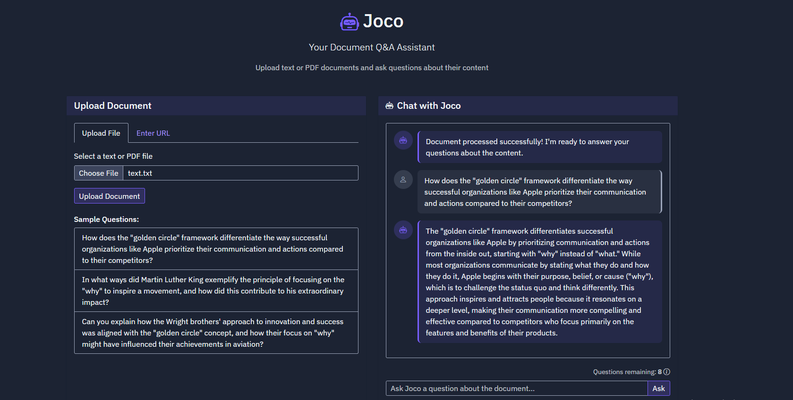

# Educational AI Chatbot



An innovative AI-powered educational chatbot that provides accurate, curriculum-aligned responses based on 6th-grade textbook content. Built with Flask and OpenAI, this tool ensures students receive reliable answers strictly from authorized educational materials.

## Features

- **Curriculum-Aligned Responses**: All answers are sourced exclusively from 6th-grade textbooks
- **Vector Database Integration**: Efficient semantic search using FAISS
- **AI-Powered Q&A**: Advanced language model integration with OpenAI
- **Document Processing**: Support for PDF and TXT files
- **Content Verification**: Ensures responses are strictly based on authorized educational content
- **Rate Limiting**: Prevents abuse with request limits

## Tech Stack

- **Backend**: Flask
- **AI Integration**: OpenAI API
- **Vector Database**: FAISS
- **Database**: SQLite
- **Document Processing**: PyPDF2

## Prerequisites

- Python 3.11 or higher
- OpenAI API key
- 6th-grade textbook content (PDF format)

## Installation

1. Clone the repository:
```bash
git clone <repository-url>
cd <repository-name>
```

2. Install dependencies:
```bash
pip install -r requirements.txt
```

3. Set up environment variables:
```bash
cp .env.example .env
```

Required environment variables:
```env
FLASK_APP=flask_app.py
FLASK_ENV=development
FLASK_DEBUG=1
SESSION_SECRET=your-secret-key-here
SQLALCHEMY_DATABASE_URI=sqlite:///app.db
OPENAI_API_KEY=your-openai-api-key-here
```

## Usage

1. Start the Flask application:
```bash
python flask_app.py
```

2. Access the application at `http://localhost:5000`

## API Endpoints

- `GET /`: Main application page
- `POST /upload`: Upload a document (PDF or TXT)
- `POST /ask`: Ask a question about the content
- `POST /process-url`: Process content from a URL
- `GET /remaining-requests`: Check remaining question quota
- `GET /health`: Health check endpoint

## Project Structure

```
├── flask_app.py          # Main Flask application
├── models.py            # Database models
├── utils/              # Utility functions
│   ├── document_processor.py
│   ├── vector_store.py
│   ├── openai_utils.py
│   └── request_limiter.py
├── templates/          # HTML templates
├── static/            # Static assets
└── requirements.txt   # Project dependencies
```

## Contributing

We welcome contributions! Please follow these steps:

1. Fork the repository
2. Create a feature branch
3. Commit your changes
4. Push to the branch
5. Create a Pull Request

## License

This project is licensed under the MIT License - see the LICENSE file for details.

## Acknowledgments

- OpenAI for providing the language model capabilities
- Flask team for the amazing framework 